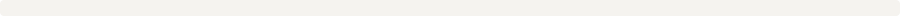
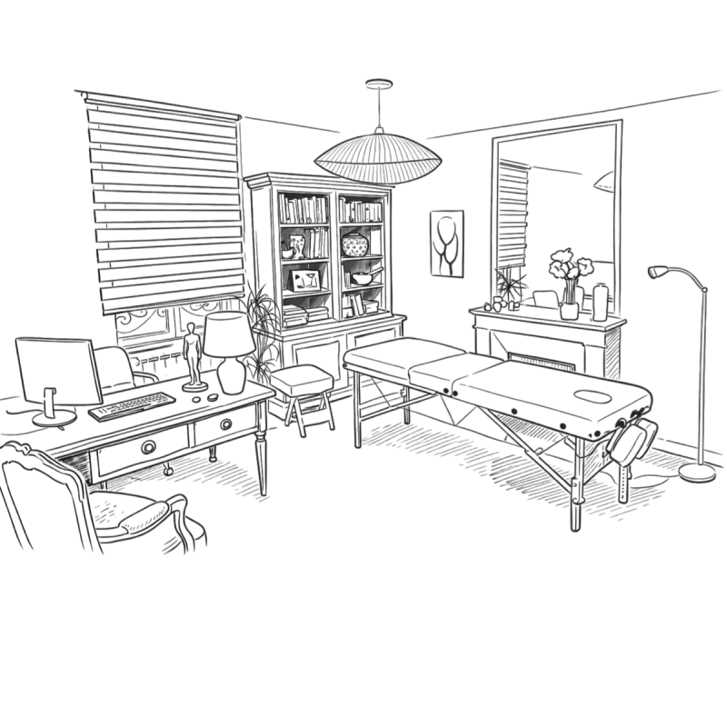

<!-- Source : `.github/profile/README.md` — `profile/README.md` à la racine pointe ici pour le profil d’organisation GitHub. GitHub supprime les fonds CSS dans les README ; bandeaux SVG (#F5F3EF, #E8E4DD) pour retrouver l’ambiance crème du site. -->
<!-- Visuels sans fond (logo RGBA, schéma SVG, parcours séance) : versions locales avec fond #F5F3EF — sources mariequintin.fr (avr. 2026). -->

<!--  -->
<!-- Logo : bordure et coins arrondis intégrés au PNG (pas de CSS sur les &lt;td&gt; côté GitHub). -->

<!-- Bloc logo + flancs crème : un seul SVG (viewBox fixe) pour rester aligné à toute largeur d’écran. -->

# Médecine Traditionnelle Chinoise & Reiki — Guérande

**Cabinet au cœur de la presqu’île Guérandaise**

Une médecine ancestrale pour un bien-être moderne — une approche naturelle au service de l’équilibre.

[Site web](https://mariequintin.fr/) · [Prendre rendez-vous](https://reservation.mariequintin.fr/)

## La Médecine Traditionnelle Chinoise (MTC)

La **Médecine Traditionnelle Chinoise**, reconnue par l’OMS, est un art thérapeutique ancestral qui considère la personne dans sa globalité — corps, énergie, émotions et environnement.

À l’image d’un jardinier attentif aux saisons et à la qualité de la terre, elle observe les équilibres et déséquilibres propres à chaque individu afin de favoriser une circulation harmonieuse de l’**énergie vitale (Qi)** et un bien-être durable.

Plutôt que de se limiter aux symptômes, la MTC cherche à comprendre le **terrain** et les **causes profondes** des troubles. Grâce à des pratiques telles que l’acupuncture, le Qi Gong et la diététique chinoise, elle accompagne l’organisme vers son équilibre naturel et le renforcement de ses défenses.

[En savoir plus : qu’est-ce que la MTC ?](https://mariequintin.fr/mtc/quest-ce-que-la-mtc)

### Principes clés

| | |
| :--- | :--- |
| **Approche globale** | Corps, énergie, émotions et environnement sont pris en compte ; on vise à comprendre le terrain de chacun, pas seulement les symptômes. |
| **Équilibre du Qi** | Au cœur de la MTC : une circulation fluide et équilibrée du Qi, pour une vitalité et un fonctionnement optimal. |
| **Harmonie Yin–Yang** | La santé repose sur l’équilibre dynamique entre le Yin et le Yang ; l’objectif est de restaurer cette harmonie durablement. |

## Pratiques et accompagnements

- **Acupuncture** · **Moxibustion** · **Ventouses**
- **Tuina** (massage chinois)
- **Qi Gong** · **Méditation**
- **Xin Li** — approche psycho-émotionnelle chinoise (émotions et énergie)
- **Conseils en diététique chinoise** et **hygiène de vie** selon les principes de la MTC
- **Reiki** (Usui)
- **Eïnothérapie** — approche holistique combinant MTC et dimension psychothérapeutique
- **Ateliers** (Qi Gong, Tuina) — écoles, collèges, lycées, entreprises, enseignants

  
  &nbsp;
  
  &nbsp;
  
  &nbsp;
  

[Détail des outils de la MTC](https://mariequintin.fr/mtc/les-outils)

## Quand consulter ?

La MTC peut être envisagée lorsque des déséquilibres physiques ou émotionnels impactent votre bien-être au quotidien, par exemple :

- **Stress et troubles émotionnels** — anxiété, nervosité, agitation, burn-out, tristesse, passages de vie difficiles
- **Fatigue et vitalité** — épuisement, baisse d’énergie, perte de motivation
- **Digestion** — ballonnements, transit irrégulier, brûlures d’estomac, nausées, inconfort après les repas
- **Sommeil** — insomnies, réveils nocturnes, sommeil non réparateur
- **Troubles respiratoires** — asthme, allergies, difficultés respiratoires, toux chronique
- **Système urinaire** — infections urinaires récurrentes, troubles de la vessie
- **Circulation** — sensibilité au froid, mains et pieds froids, œdèmes, palpitations, engourdissements
- **Douleurs** — maux de dos, tensions musculaires, douleurs articulaires, migraines, troubles musculo-squelettiques, séquelles sportives

> La Médecine Traditionnelle Chinoise **ne pose pas de diagnostic médical** et **ne remplace pas un suivi médical**. Elle s’inscrit dans une approche **complémentaire**, **préventive** et **globale**, pour mieux se connaître et retrouver son équilibre.

[Prendre rendez-vous](https://reservation.mariequintin.fr/)

## Comment se déroule une séance ?

Chaque séance est un **temps d’écoute et d’observation**, personnalisé.

1. **Un temps d’écoute approfondi** — histoire de vie, mode de vie, sommeil, alimentation, état émotionnel et ressenti général.
2. **Observation selon les principes de la MTC** — notamment observation de la langue, prise des pouls, attention à la posture et à la respiration.
3. **Proposition d’outils adaptés au bilan énergétique** — acupuncture, ventouses, moxibustion, Tuina, Xin Li, Qi Gong et méditation, diététique chinoise, conseils d’hygiène de vie.

  

## Pourquoi s’intéresser à la MTC ?

- **Reconnaissance internationale** — la médecine traditionnelle n’est pas reléguée au passé ; l’OMS met en avant son rôle dans les systèmes de santé. [Article ONU / OMS (2023)](https://news.un.org/fr/story/2023/08/1137712)
- **Visée préventive** — attention aux causes profondes, réduction du stress global, soutien de l’immunité.
- **Approche naturelle et holistique** — nombreux troubles peuvent être abordés dans cette logique d’ensemble (douleurs, stress, digestion, etc.).

## Marie Quintin

  

Guérandaise, j’ai vécu au **Cambodge** il y a près de trente ans une expérience fondatrice qui a éveillé mon intérêt pour les approches traditionnelles du soin et la compréhension des équilibres entre le corps et l’énergie.

Je me suis formée en **Médecine Traditionnelle Chinoise** au sein de l’école **CEDRE** (Collectif d’Étude, de Développement et de Recherche en Ethnomédecine), avec une certification dans un enseignement fondé par **Patrick Shan**, dans la continuité du travail du **Dr Leung Kok Yuen**, héritier d’une tradition familiale orale transmise sur quinze générations.

[Mon parcours](https://mariequintin.fr/qui-suis-je)

## Autres accompagnements

| | Liens |
| :--- | :--- |
| **Reiki** | Harmonisation énergétique, détente, cabinet ou à distance — [mariequintin.fr/reiki](https://mariequintin.fr/reiki) |
| **Ateliers** | Qi Gong & Tuina, publics variés — [mariequintin.fr/atelier](https://mariequintin.fr/atelier) |
| **Eïnothérapie** | Approche holistique corps–esprit — [mariequintin.fr/einotherapie](https://mariequintin.fr/einotherapie) |

## Contact & rendez-vous

- **Site** : [https://mariequintin.fr/](https://mariequintin.fr/)
- **Contact** : [https://mariequintin.fr/contact](https://www.mariequintin.fr/contact)
- **Réservation en ligne** : [https://reservation.mariequintin.fr/](https://reservation.mariequintin.fr/)

*Les témoignages et retours d’expérience partagés ailleurs sur le site ou les réseaux reflètent des parcours individuels ; les effets peuvent varier selon les personnes.*

**Merci de votre visite sur le profil de l’organisation.**

